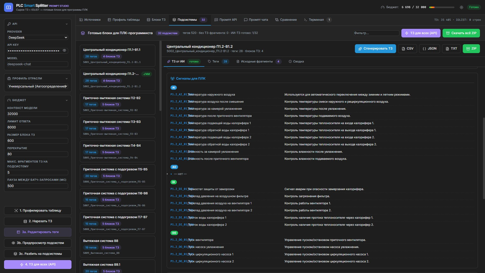
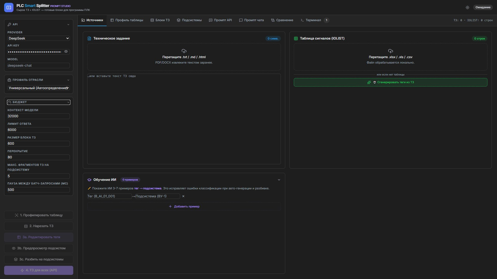
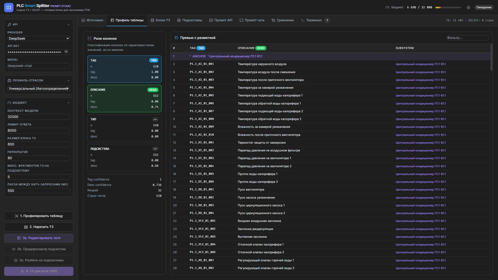
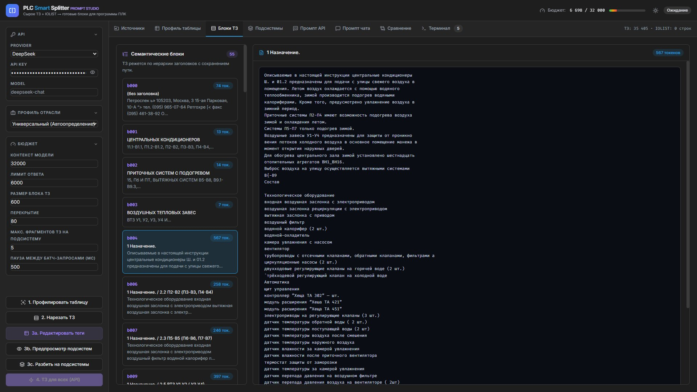
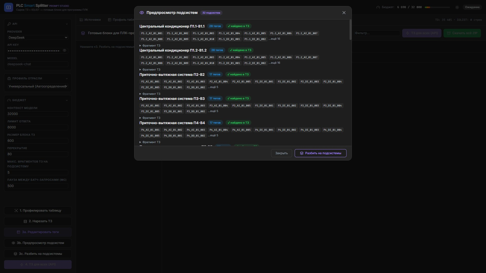
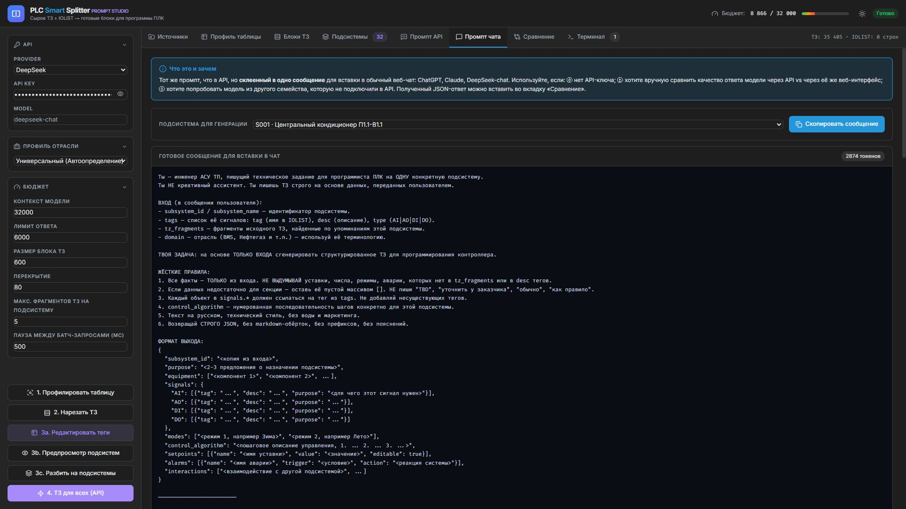
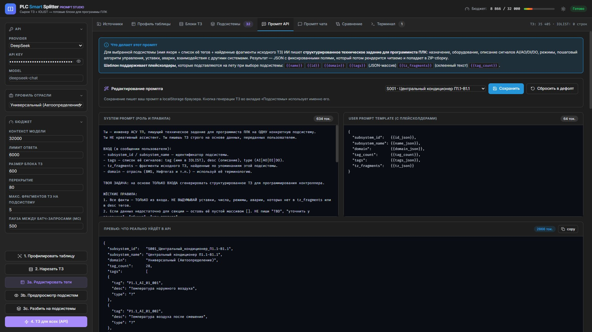
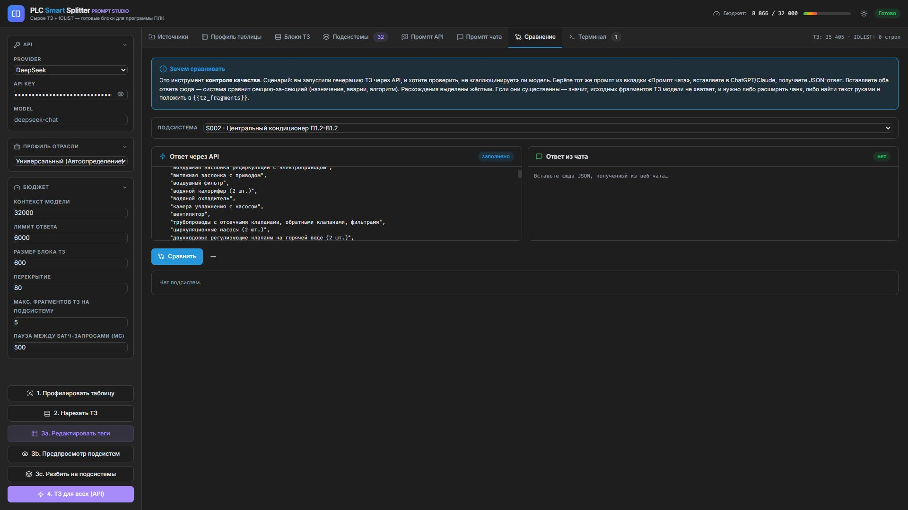

# ⚡ PLC Smart Splitter — Prompt Studio

### Сырое ТЗ + IOLIST → готовые блоки технического задания для программиста ПЛК

**Превращает многостраничное техническое задание и таблицу сигналов в структурированное ТЗ по каждой подсистеме — с помощью ИИ, локально на вашем ПК, за минуты.**

---

> 📺 **Видеообзор программы:** https://www.youtube.com/watch?v=dQw4w9WgXcQ
> *(ссылка-заглушка — будет заменена на официальное видео)*

---

## 🎯 Зачем эта программа

Перед тем как программировать контроллер, инженер АСУ ТП тратит часы на рутину: вычитывает «простыню» технического задания, вручную сопоставляет его с таблицей сигналов (IOLIST), выписывает для каждой подсистемы её сигналы, уставки, аварии и алгоритм работы.

**PLC Smart Splitter делает это за вас.** Вы загружаете два файла — ТЗ и таблицу сигналов — и получаете аккуратные, готовые к работе блоки технического задания по каждой подсистеме. Каждый блок содержит назначение, перечень оборудования, описание сигналов AI/AO/DI/DO, режимы работы, пошаговый алгоритм управления, уставки, аварии и взаимодействия с другими системами.

Результат выгружается в **CSV / JSON / TXT** или единым **ZIP-архивом** по всему проекту.

> 💡 Главное: программа пишет ТЗ **строго на основе ваших данных** — она не выдумывает уставки, числа и режимы, которых нет в исходных документах.

---

## ✨ Возможности

| | Функция | Что даёт |
|---|---|---|
| 📥 | **Импорт ТЗ и IOLIST** | Загрузка ТЗ и таблицы сигналов. Обработка полностью **локальная** — данные не покидают ваш ПК (кроме запроса к ИИ). |
| 🧠 | **Автопрофилирование таблицы** | Программа сама определяет, где тег, где описание, где тип и где подсистема — по характеру значений, а не по названиям колонок. |
| ✂️ | **Семантическая нарезка ТЗ** | ТЗ режется на смысловые блоки по иерархии заголовков с сохранением пути. |
| 🗂️ | **Группировка по подсистемам** | Сигналы автоматически раскладываются по подсистемам, к каждой подбираются нужные фрагменты ТЗ. |
| 🤖 | **Генерация ТЗ через ИИ** | По каждой подсистеме модель пишет полное структурированное ТЗ для программиста. |
| 💬 | **Режим без API-ключа** | Готовый промпт для вставки в веб-чат ChatGPT / Claude / DeepSeek, если своего ключа нет. |
| 🔍 | **Сравнение ответов** | Контроль качества: сравнение ответа из API и из чата с подсветкой расхождений. |
| 🎓 | **Обучение на примерах** | Покажите ИИ 3–7 примеров «тег → подсистема», чтобы исправить классификацию. |
| 📦 | **Экспорт** | CSV, JSON, TXT по подсистеме и общий ZIP по проекту. |

---

## 🚀 Быстрый старт

1. **Скачайте** `PLC_Smart_Splitter_v2.exe` из раздела [Releases](../../releases).
2. Положите файл в **отдельную папку** (рядом с ним программа будет хранить рабочие данные).
3. **Запустите** `PLC_Smart_Splitter_v2.exe`.
4. Откроется окно с пробным периодом и вашим **Hardware ID**, затем автоматически — браузер с интерфейсом на `http://127.0.0.1:8053`.
5. Чтобы пользоваться генерацией ТЗ через ИИ, укажите свой **API-ключ DeepSeek** в панели слева (см. [Требования](#-требования-и-форматы-файлов)).

> Антивирус может проверять впервые запущенный `.exe` — это нормально для новых программ. При необходимости добавьте файл в исключения.

---

## 📖 Как работать: пошаговый сценарий

Весь процесс — это четыре кнопки в левой панели, сверху вниз:
**1. Профилировать таблицу → 2. Нарезать ТЗ → 3. Разбить на подсистемы → 4. ТЗ для всех.**

### Шаг 1. Загрузите исходные данные (вкладка «Источники»)
Перетащите файл ТЗ и таблицу сигналов (IOLIST) в соответствующие поля. Текст ТЗ можно также вставить вручную. Если таблицы сигналов нет — её можно **сгенерировать прямо из текста ТЗ** кнопкой «Сгенерировать теги из ТЗ».

### Шаг 2. Проверьте профиль таблицы (вкладка «Профиль таблицы»)
Нажмите **«1. Профилировать таблицу»**. Программа классифицирует колонки и покажет разметку: тег, описание, подсистема. Здесь видно уверенность определения и число найденных подсистем-якорей. Если что-то определилось неверно — добавьте примеры в блоке «Обучение ИИ» на первой вкладке.

### Шаг 3. Нарежьте ТЗ на блоки (вкладка «Блоки ТЗ»)
Нажмите **«2. Нарезать ТЗ»**. Документ разобьётся на смысловые блоки по заголовкам — с подсчётом токенов в каждом. Это нужно, чтобы к каждой подсистеме подобрать релевантный кусок ТЗ.

### Шаг 4. Разбейте на подсистемы и проверьте предпросмотр
Нажмите **«3c. Разбить на подсистемы»** (можно сначала посмотреть **«3b. Предпросмотр подсистем»**, чтобы убедиться, что сигналы сгруппировались верно).

### Шаг 5. Сгенерируйте ТЗ и скачайте результат (вкладка «Подсистемы»)
Нажмите **«4. ТЗ для всех (API)»** — ИИ напишет техническое задание по каждой подсистеме. Готовый результат скачивается кнопкой **«Скачать всё ZIP»** или по отдельности в форматах **CSV / JSON / TXT**.

> 🟰 **Итог:** загрузили ТЗ + IOLIST → нажали 4 кнопки → получили ZIP с готовыми блоками ТЗ по всем подсистемам.

---

## 🧰 Дополнительные инструменты

<b>💬 Работа без API-ключа («Промпт чата»)</b>

Если у вас нет API-ключа, программа соберёт готовое сообщение для вставки в обычный веб-чат (ChatGPT, Claude, DeepSeek). Скопируйте его, вставьте в чат, а полученный JSON-ответ верните во вкладку «Сравнение».

<b>📝 Настройка промпта (для опытных пользователей)</b>

System- и user-промпт можно редактировать. Поддерживаются плейсхолдеры `{{name}}`, `{{id}}`, `{{domain}}`, `{{tags}}`, `{{tz_fragments}}`, `{{tag_count}}`, которые подставляются автоматически. Превью показывает, что реально уйдёт в модель.

<b>🔍 Контроль качества («Сравнение»)</b>

Сценарий: вы сгенерировали ТЗ через API и хотите убедиться, что модель не «галлюцинирует». Вставьте сюда ответ через API и ответ из веб-чата — программа сравнит их секция-за-секцией и подсветит расхождения жёлтым.

---

## 📋 Требования и форматы файлов

**Система:** Windows 10/11 (64-бит). Установка не требуется — программа запускается из одного файла.

**Поддерживаемые форматы:**

| Тип данных | Форматы |
|---|---|
| Техническое задание (ТЗ) | `.txt`, `.md`, `.html` (PDF/DOCX извлеките в текст заранее) |
| Таблица сигналов (IOLIST) | `.xlsx`, `.xls`, `.csv` |
| Экспорт результата | `.csv`, `.json`, `.txt`, `.zip` |

**API-ключ DeepSeek** (для генерации ТЗ через ИИ):
1. Зарегистрируйтесь на [platform.deepseek.com](https://platform.deepseek.com/) и создайте API-ключ.
2. Вставьте ключ в поле **API KEY** в левой панели программы.
3. Без ключа доступен режим «Промпт чата» — генерация через любой веб-чат вручную.

---

## 🔐 Лицензия и активация

Программа работает по модели **пробный период → постоянная лицензия**, с привязкой к вашему компьютеру.

### Как активировать

1. **Запустите программу.** Первые **5 дней** она работает бесплатно — все функции доступны.
2. В окне при запуске показан ваш уникальный **Hardware ID**. Скопируйте его кнопкой **«Копировать ID»**.
3. **Отправьте Hardware ID** на почту **support@plcstudio.ru** для приобретения лицензии.
4. В ответ вы получите файл **`license.key`**.
5. **Положите `license.key` в ту же папку, где лежит `.exe`** — и программа начнёт работать без ограничений.

> Можно также вставить полученный ключ прямо в поле активации в окне программы — файл создастся автоматически.

### Частые вопросы по лицензии

**Я потерял `license.key` — что делать?**
Напишите на support@plcstudio.ru с вашим Hardware ID — вышлем файл повторно. Покупать заново не нужно.

**Я меняю компьютер или переустанавливаю Windows — лицензия пропадёт?**
Лицензия привязана к «железу», поэтому на новом ПК старый ключ работать не будет. Пришлите новый Hardware ID (его покажет программа на новом компьютере) на support@plcstudio.ru — мы аннулируем старую лицензию и выпустим новую. Перенос для легальных пользователей бесплатный.

**Можно ли использовать одну лицензию на двух ПК?**
Нет, одна лицензия = один компьютер. Для нескольких рабочих мест нужны отдельные лицензии.

---

## ❓ FAQ — частые проблемы

<b>Программа не запускается / антивирус блокирует</b>

Новые `.exe` без массовой репутации иногда вызывают подозрение у антивирусов (ложное срабатывание). Добавьте файл в исключения антивируса или Windows Defender. Программа не требует прав администратора и работает локально.

<b>Браузер не открылся автоматически</b>

Откройте браузер вручную и перейдите по адресу **http://127.0.0.1:8053** — программа уже работает в фоне. Не закрывайте чёрное окно (консоль) — это и есть работающий сервер.

<b>Ошибка «проверки лицензии» при запуске</b>

Убедитесь, что `license.key` лежит **в той же папке**, что и `.exe`, и что он выдан именно для этого компьютера (Hardware ID совпадает). Если меняли ПК или Windows — запросите новый ключ (см. раздел «Лицензия»).

<b>Генерация ТЗ выдаёт ошибку</b>

Проверьте, что введён корректный **API-ключ DeepSeek** и на балансе аккаунта есть средства. Если ключа нет — воспользуйтесь режимом «Промпт чата».

<b>Подсистемы определились неправильно</b>

Добавьте 3–7 примеров «тег → подсистема» в блоке **«Обучение ИИ»** на вкладке «Источники» и повторите профилирование — это исправляет ошибки классификации.

<b>Модель «выдумывает» данные</b>

Программа специально настроена писать ТЗ только на основе ваших документов. Если в результате не хватает деталей — значит, их не было в найденных фрагментах ТЗ. Используйте вкладку «Сравнение», чтобы увидеть, где модели не хватило исходного текста, и при необходимости дополните ТЗ.

---

## 🧪 Технологии под капотом

Что обеспечивает результат — кратко о ключевых механизмах программы:

- **🔬 Профилирование таблицы по содержимому, а не по заголовкам.**
  Колонки IOLIST классифицируются (тег / описание / тип / подсистема) на основе статистики самих значений: доли уникальных записей, длины и структуры строк, шаблонов тегов. Поэтому программа работает с таблицами в любом оформлении, без жёсткой привязки к названиям столбцов.

- **🧭 Поиск якорей-подсистем.**
  Алгоритм находит «опорные» строки-якоря, которые задают границы подсистем, и автоматически приписывает каждый сигнал к своей подсистеме.

- **✂️ Иерархическая нарезка ТЗ.**
  Текст ТЗ разбивается по структуре заголовков с сохранением пути (раздел → подраздел) и подсчётом токенов, чтобы каждый блок укладывался в контекст модели и не терял смысловую связность.

- **🎯 Релевантный подбор фрагментов.**
  Для каждой подсистемы из всего ТЗ подбираются только относящиеся к ней фрагменты — модель получает сфокусированный контекст, а не весь документ целиком.

- **🤖 Генерация со строгим JSON-форматом.**
  Промпт жёстко фиксирует структуру ответа (назначение, оборудование, сигналы AI/AO/DI/DO, режимы, алгоритм, уставки, аварии, взаимодействия). Это исключает «воду» и облегчает дальнейшую обработку.

- **🛡️ Антигаллюцинационные правила и контроль качества.**
  Модели прямо запрещено выдумывать данные, которых нет во входе. Вкладка «Сравнение» позволяет сверить два ответа и увидеть расхождения.

- **💰 Управление контекстом и бюджетом.**
  Настройки контекста, лимита ответа, размера блока, перекрытия и пауз между батч-запросами дают контроль над расходом токенов и стабильностью генерации.

- **🔒 Локальная обработка и офлайн-лицензирование.**
  Разбор файлов идёт на вашем ПК. Лицензия привязана к оборудованию (Hardware ID на базе характеристик системы) и подписана криптографически — работает без постоянного подключения к серверу.

**Используемый стек:** Python · Flask · pandas · DeepSeek API. Интерфейс — локальное веб-приложение, открывается в вашем браузере.

---

## 🔗 Ссылки и поддержка

- 🌐 **Сайт:** [plcstudio.ru](https://plcstudio.ru/)
- 📺 **Видеообзор:** [YouTube](https://www.youtube.com/watch?v=dQw4w9WgXcQ) *(заглушка — будет заменена)*
- ✉️ **Покупка лицензии и техподдержка:** support@plcstudio.ru

---

## 📄 Лицензия

© PLC Studio. Коммерческое программное обеспечение. Все права защищены.
Использование без действующей лицензии не допускается. Условия приобретения — на [plcstudio.ru](https://plcstudio.ru/).

---

**Сделано для инженеров АСУ ТП — чтобы тратить время на алгоритмы, а не на разбор ТЗ.**

[plcstudio.ru](https://plcstudio.ru/) · support@plcstudio.ru

